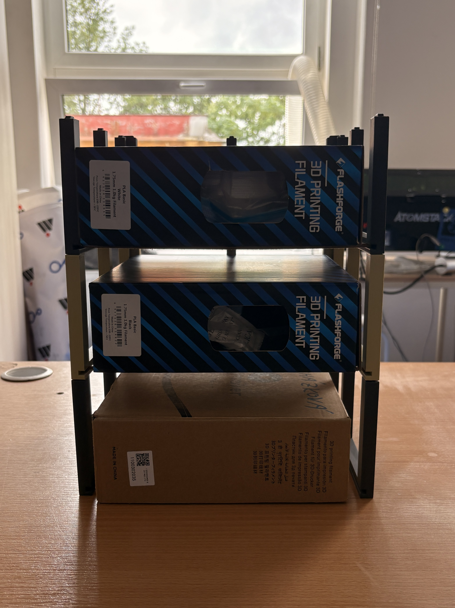
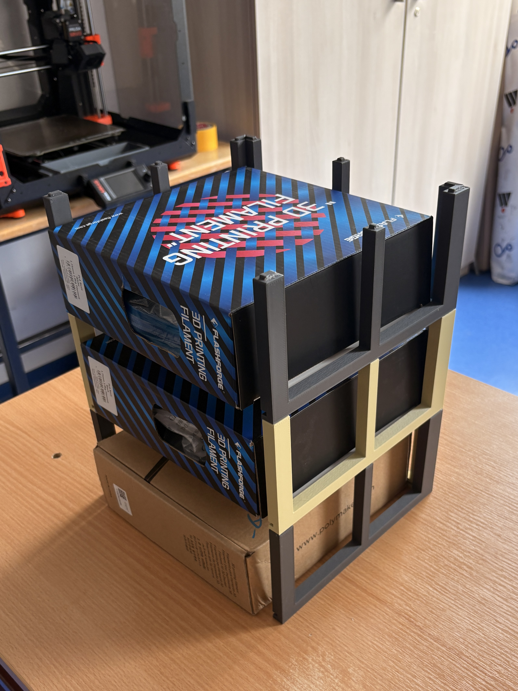
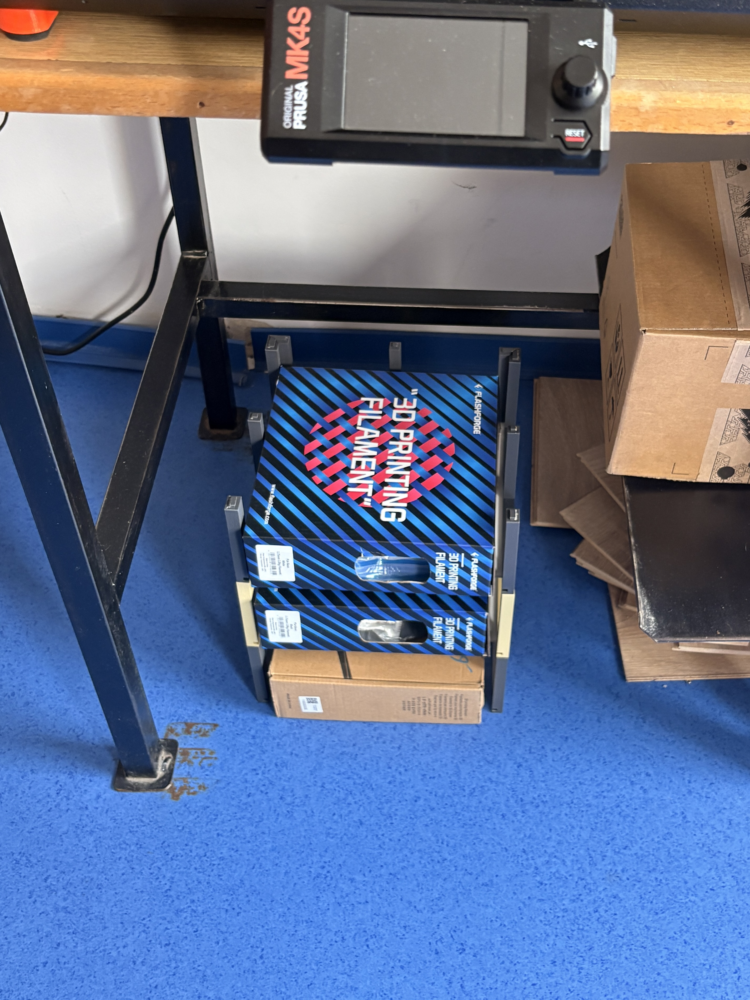

# Polička na filamenty pod stůl

## Popis

3D tištěná modulární polička určená pro umístění do stolu nebo prostoru pod 3D tiskárnou. Projekt slouží k přehlednému skladování filamentů a lepšímu využití místa kolem tiskárny.

Jednotlivé části mohou být vytištěny samostatně a následně sestaveny do funkční police bez složitých úprav.

## Fotografie
|  |  | 
| :---: | :---: |
|  |  |

## To-do list

- [x] Změřit prostor pod stolem
- [x] Navrhnout základní tvar a rozměry poličky
- [ ] Vytisknout testovací díl
- [ ] Upravit vůle a spoje podle výsledku testu
- [ ] Vytisknout kompletní sadu dílů
- [ ] Sestavit poličku a otestovat stabilitu
